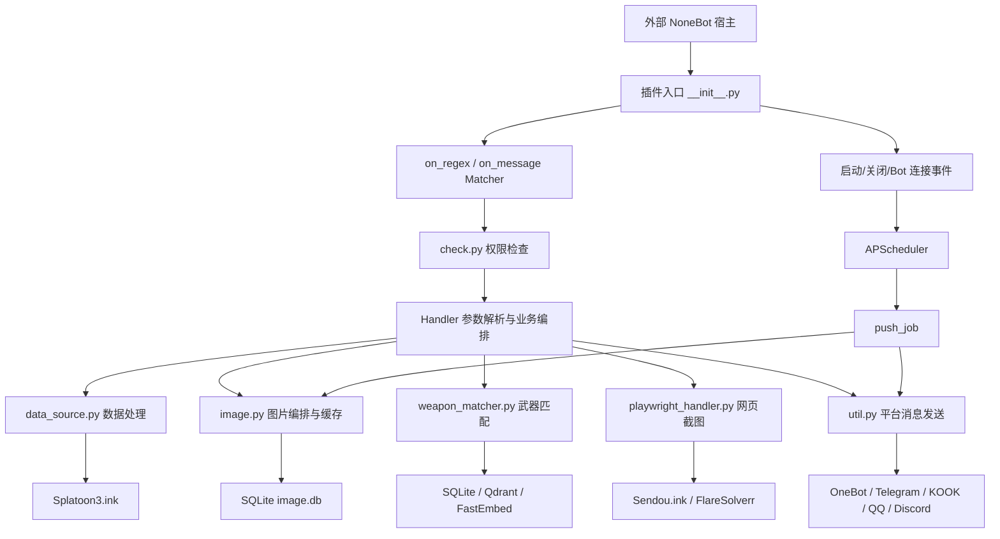
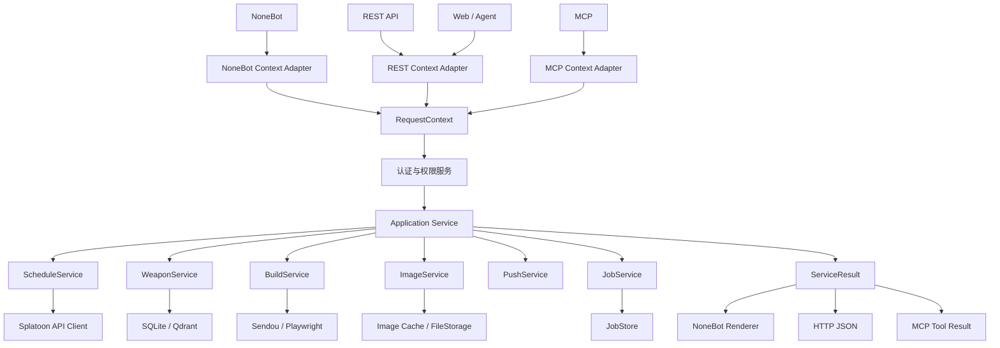

# 多平台与 MCP 改造说明

## 1. 改造目标

将项目从“平台 adapter 直接承载业务逻辑”的结构，改造成“独立业务服务 + 多平台适配器”的结构。

目标是让以下入口都能复用同一套核心能力：

- QQ、Telegram、Discord 等消息平台
- Web 前端
- REST API
- MCP
- WebSocket / SSE
- 其他 AI Agent 或自动化工具

目标架构：

```text
平台入口层
    ↓
统一 Application Service
    ↓
核心业务层
    ↓
基础设施层
```

完整调用关系：

```text
QQ / Telegram / Web / REST / MCP / AI Agent
                    ↓
          Application Service
                    ↓
             Core Business
                    ↓
      API / DB / Redis / 文件 / 图片服务
```

核心原则：

> 平台只负责接收请求和展示结果，业务逻辑不依赖具体平台。

---

## 2. 当前问题

平台入口通常同时包含以下职责：

- 命令解析
- 平台用户身份获取
- 核心业务处理
- 外部 API 请求
- 数据解析
- 图片生成
- 消息发送
- 错误提示
- 长任务进度通知

这种结构会导致每增加一个平台，就需要重复适配业务逻辑。

应将这些职责拆开：

```text
请求解析       → 平台适配层
身份获取       → 认证/身份层
业务编排       → Application 层
业务规则       → Domain/Core 层
外部调用       → Infrastructure 层
消息展示       → 平台适配层
任务状态       → JobService
```

---

## 3. 平台适配层职责

平台适配层只负责：

1. 接收平台消息、HTTP 请求或 MCP 请求
2. 解析参数
3. 获取调用上下文
4. 调用统一 Application Service
5. 将结构化结果转换为平台支持的格式
6. 返回文本、图片、文件或错误提示

平台适配层不应负责：

- 核心业务计算
- 外部 API 请求
- 数据解析
- 图片生成
- Token 刷新
- 任务状态管理
- 平台无关的错误判断

理想的消息平台入口：

```python
async def handler(bot, event):
    params = parse_request(event)
    result = await application_service.execute(params)
    await platform_renderer.send_result(bot, event, result)
```

理想的 REST 入口：

```python
@router.post("/jobs")
async def create_job(request: CreateJobRequest):
    return await application_service.create_job(request)
```

理想的 MCP 入口：

```python
@mcp.tool()
async def execute(operation: str, params: dict) -> dict:
    return await application_service.execute(operation, params)
```

三种入口调用同一套 Application Service，不复制业务逻辑。

---

## 4. 核心业务层解耦要求

核心业务代码不得依赖具体 adapter 或消息平台对象，包括但不限于：

```text
Bot
Event
Matcher
Message
QQ_Bot
TelegramBot
DiscordMessage
平台专属消息段
```

核心业务代码中不应出现大量平台判断：

```python
if platform == "QQ":
if isinstance(bot, QQ_Bot):
if isinstance(event, QQ_C2CME):
```

这些判断只能存在于对应的平台适配层。

核心业务应该只接收：

- 业务参数
- 配置对象
- 内部数据对象
- 必要的请求上下文

示例：

```python
async def generate_report(
    account_id: int,
    report_type: str,
) -> ReportResult:
    ...
```

如果项目不需要区分用户，可以不引入复杂账户系统，只使用：

```python
client_id
api_key
tenant_id
request_id
```

---

## 5. 统一身份模型

如果项目涉及用户或账号，需要区分以下概念：

```text
外部平台身份 ≠ 内部用户/账号 ≠ 业务账号
```

推荐关系：

```text
平台身份
    ↓
外部身份映射
    ↓
内部 account_id
    ↓
业务数据
```

外部身份示例：

```text
QQ：provider=qq, subject=123456
Telegram：provider=telegram, subject=987654
Web：provider=web, subject=account_abc
MCP：provider=mcp, subject=token_owner_42
```

如果另一个项目不涉及登录和用户账号，可以暂时跳过：

- 登录绑定码
- 跨平台账号绑定
- Access Token 刷新
- 外部身份与内部账号映射

只保留简单的请求认证即可，例如 API Key 或 Bearer Token。

对于涉及账号绑定的项目：

```text
绑定码：只负责首次建立关联，短期、一次性
Access Token：负责后续调用身份认证
```

不要将绑定码作为每个工具调用的参数。

---

## 6. 统一结构化返回结果

核心服务不直接发送平台消息，也不返回平台专属消息对象。

建议返回统一结构化结果：

```python
@dataclass
class ServiceResult:
    status: str
    message: str
    data: dict
    image_url: str | None = None
    image_path: str | None = None
    file_url: str | None = None
    warnings: list[str] = field(default_factory=list)
```

示例：

```json
{
  "status": "completed",
  "message": "处理完成",
  "data": {
    "name": "example",
    "score": 95
  },
  "image_url": "https://example.com/result.png",
  "warnings": []
}
```

不同入口自行渲染：

```text
QQ：转换为 QQ 文本和图片消息
Telegram：转换为 Telegram Markdown 和图片
Web：直接返回 JSON
MCP：返回结构化文本、JSON 和图片 URL
AI Agent：返回容易理解的 Markdown 或 JSON
```

---

## 7. 业务异常处理

核心业务层不应直接发送消息：

```python
await bot.send(...)
await telegram.send(...)
```

应返回结果或抛出平台无关的业务异常：

```python
class LoginRequiredError(Exception):
    pass

class ExternalServiceError(Exception):
    pass
```

不同入口自行处理：

```text
QQ：业务异常 → QQ 提示消息
Telegram：业务异常 → Telegram 消息
Web：业务异常 → HTTP JSON
MCP：业务异常 → Tool Result
```

核心服务只负责记录日志、更新任务状态和抛出异常。

---

## 8. 长耗时任务设计

可能持续几十秒或几分钟的操作，不应依赖原始 HTTP/MCP 连接一直保持。

统一使用异步任务模式：

```text
创建任务
    ↓
立即返回 job_id
    ↓
后台执行
    ↓
更新任务状态
    ↓
查询任务状态
    ↓
获取最终结果
```

统一任务模型：

```python
@dataclass
class Job:
    id: str
    owner_id: str | None
    operation: str
    status: str
    stage: str
    progress: int
    result: dict | None
    error: dict | None
```

任务状态示例：

```json
{
  "job_id": "job_123",
  "status": "running",
  "stage": "rendering",
  "progress": 70,
  "message": "正在生成图片"
}
```

完成状态：

```json
{
  "job_id": "job_123",
  "status": "completed",
  "data": {},
  "image_url": "https://example.com/result.png"
}
```

失败状态：

```json
{
  "job_id": "job_123",
  "status": "failed",
  "code": "EXTERNAL_API_ERROR",
  "message": "外部服务请求失败"
}
```

如果任务需要用户重新认证，应立即返回：

```json
{
  "status": "reauth_required",
  "code": "LOGIN_REQUIRED",
  "message": "请重新完成登录"
}
```

不要让任务无限挂起等待用户操作。

任务状态应由统一 `JobService` 管理，而不是由 MCP、QQ、Web 各自实现。

---

## 9. 多平台进度展示

统一任务服务只记录：

- 当前阶段
- 进度
- 状态
- 提示信息
- 错误信息
- 最终结果

各平台决定展示方式：

```text
QQ：发送多条进度消息，最后发送图片
Telegram：编辑原消息显示进度
Web：使用 SSE 推送进度
MCP：通过 get_job_status 查询
AI Agent：轮询任务或接收 webhook
```

统一任务服务不直接调用平台 API：

```python
await job_service.update(
    job_id,
    stage="rendering",
    progress=70,
    message="正在生成图片",
)
```

MCP 进度通知可以作为增强，但不能作为唯一机制，因为并非所有 MCP 客户端都能展示进度或长时间保持连接。

---

## 10. REST API 设计

REST API 建议作为通用基础入口，便于 Web、脚本、移动端、AI 工具和其他服务调用。

推荐接口：

```text
POST /api/jobs
GET  /api/jobs/{job_id}
GET  /api/jobs/{job_id}/events
POST /api/jobs/{job_id}/cancel
```

创建任务：

```json
{
  "operation": "generate_report",
  "params": {
    "type": "daily"
  }
}
```

返回：

```json
{
  "job_id": "job_123",
  "status": "queued"
}
```

实时进度可以使用 SSE：

```text
GET /api/jobs/{job_id}/events
```

如果需要复杂双向交互、取消或动态修改参数，再考虑 WebSocket。

---

## 11. MCP 设计

MCP 是 AI 调用工具的适配层，不是核心业务层。

MCP 工具只负责：

1. 定义工具名称和参数
2. 获取调用上下文
3. 调用 Application Service
4. 将结果转换成 AI 易于理解的格式

短任务可以直接返回结果：

```python
@mcp.tool()
async def get_report(report_type: str = "daily") -> dict:
    return await application_service.get_report(report_type)
```

长任务建议返回任务：

```python
@mcp.tool()
async def create_report(report_type: str = "daily") -> dict:
    job = await job_service.create(
        operation="generate_report",
        params={"report_type": report_type},
    )
    return {
        "status": "accepted",
        "job_id": job.id,
        "message": "任务已创建，请查询任务状态",
    }
```

再提供：

```python
@mcp.tool()
async def get_job_status(job_id: str) -> dict:
    return await job_service.get_status(job_id)
```

MCP 可以在内部轮询任务后一次性返回最终结果，但底层仍应使用任务系统，避免把任务绑定在长连接上。

---

## 12. 图片和文件处理

核心业务可以生成：

- 文件路径
- 文件内容
- 文件 ID
- 对象存储 URL

但不要生成平台专属的图片消息对象。

推荐流程：

```text
核心业务生成文件
    ↓
保存临时文件或上传对象存储
    ↓
返回 image_url / file_url
    ↓
各平台转换为自己的消息格式
```

优先返回 URL，而不是在 MCP 或 API 响应中塞入大段 Base64：

```json
{
  "image_url": "https://cdn.example.com/result.png",
  "expires_at": "2026-09-05T20:00:00+08:00"
}
```

需要设计：

- 临时文件清理
- URL 过期时间
- 访问权限
- 文件大小限制
- 上传失败处理

---

## 13. 推荐目录结构

项目较大时可以逐步演进为：

```text
project/
├── domain/
│   ├── models.py
│   ├── exceptions.py
│   └── value_objects.py
├── application/
│   ├── services.py
│   ├── job_service.py
│   └── dto.py
├── infrastructure/
│   ├── external_client.py
│   ├── repository.py
│   ├── task_queue.py
│   ├── image_renderer.py
│   └── storage.py
├── interfaces/
│   ├── rest/
│   ├── mcp/
│   ├── websocket/
│   └── platforms/
└── existing_platform/
```

项目规模较小时可以先使用简单结构：

```text
app/
├── service.py
├── job.py
├── models.py
├── api.py
├── mcp.py
└── platform_adapter.py
```

目录名称不是重点，职责边界才是重点。不需要一次性移动所有文件。

---

## 14. 推荐实施顺序

### 阶段一：代码审计

先找出：

- 所有启动入口
- 所有平台 adapter 依赖
- 所有命令、路由和事件入口
- 所有核心业务函数
- 所有外部 API 请求
- 所有数据库、缓存和文件处理
- 所有消息发送逻辑
- 所有图片生成逻辑
- 所有长耗时任务

此阶段只分析，不修改代码。

### 阶段二：抽取结构化业务结果

让核心业务返回：

```text
文本
结构化数据
文件路径或 URL
警告
状态
```

不返回平台消息对象。

### 阶段三：抽取 Application Service

将平台 handler 中的业务流程移动到统一服务。

平台入口只保留：

```text
解析参数 → 调用服务 → 发送结果
```

### 阶段四：抽取平台展示逻辑

为不同平台保留各自的：

- 文本模板
- Markdown/HTML 格式
- 图片消息格式
- 卡片、Embed 或消息段
- 错误展示方式

### 阶段五：增加 JobService

所有可能超过几十秒的操作统一接入：

```text
job_id
status
stage
progress
result
error
```

### 阶段六：实现 REST API

先让外部程序可以稳定调用核心能力。

### 阶段七：实现 MCP

MCP 只包装已有的 Application Service，不复制业务逻辑。

### 阶段八：扩展其他平台

新增平台只实现：

```text
请求解析
参数转换
结果渲染
进度展示
```

不重新修改核心业务。

---

## 15. 另一个不涉及登录项目的简化方案

如果项目不涉及 NSO 登录、用户账号或跨平台绑定，可以直接采用：

```text
平台请求
    ↓
统一请求参数
    ↓
Application Service
    ↓
JobService
    ↓
核心业务
    ↓
结构化结果
```

可以暂时省略：

- 登录绑定码
- 跨平台账号绑定
- 内部账号映射
- Token 刷新
- 用户会话管理

只实现：

1. 平台解耦
2. 统一业务服务
3. 结构化返回结果
4. 长任务管理
5. REST API
6. MCP 适配层

这是最适合先落地的改造范围。

---

## 16. 开始改造前的审计提示词

将下面内容发送给目标项目中的 Trae：

```text
我希望将当前项目从“平台 adapter 直接承载业务逻辑”的架构，改造成可被多个平台、REST API、MCP 和 AI 工具调用的统一应用服务。

当前项目不涉及 NSO 用户登录，也不需要复杂的跨平台账号绑定。请重点关注业务逻辑与平台 adapter 的解耦。

目标：
1. 保留现有平台功能
2. 增加 REST API 调用能力
3. 增加 MCP 调用能力
4. 未来可以扩展 Web、Telegram、Discord 或其他 AI 工具
5. 核心业务不依赖具体 adapter
6. 核心业务不直接发送平台消息
7. 核心业务不接收 Bot、Event、Message 等平台对象
8. 平台入口只负责请求解析、调用服务和结果展示
9. 核心服务返回结构化结果
10. 长耗时操作使用 job_id 和统一任务状态管理
11. 图片和文件结果通过文件路径、文件 ID 或 URL 返回
12. MCP 和 REST API 调用同一套 Application Service
13. 不要重复实现 MCP 专属的业务逻辑
14. 不要一次性大规模重构或移动所有文件
15. 每个阶段完成后保留现有功能并进行验证

请先不要修改代码，先完成代码审计，分析：
1. 当前项目启动入口
2. 当前所有 adapter 和平台依赖
3. 所有命令、路由和事件入口
4. 核心业务逻辑位置
5. 外部 API、数据库、缓存和文件处理
6. 图片、文本和其他结果生成逻辑
7. 业务逻辑与平台消息发送的耦合点
8. 长耗时任务和后台任务
9. 当前可以抽取的统一业务服务
10. 适合增加 REST API 和 MCP 的位置

请输出：
- 当前架构图
- 入口到业务的调用链
- 平台耦合点列表
- 推荐的分层结构
- 需要新增、修改和暂时不动的文件
- 分阶段改造计划

请先只分析，不要修改文件。
```

---

## 17. 最终判断

改造目标不是：

```text
把当前 adapter 替换成 MCP
```

而是：

```text
把项目从“平台驱动的插件”改造成“独立业务服务 + 多平台适配器”。
```

最终结构：

```text
统一业务服务
    ├── QQ 适配器
    ├── Telegram 适配器
    ├── Web API
    ├── MCP
    ├── WebSocket/SSE
    └── 其他 AI 或自动化工具
```

最重要的三个改造点：

```text
1. 抽离平台依赖
2. 统一结构化返回结果
3. 统一管理长耗时任务
```

---

# 18. 当前项目代码审计结论

> 本章基于当前仓库实际代码整理，用于将前述通用原则落到本项目。审计时未修改代码、配置或依赖。

## 18.1 当前项目定位

当前项目是一个依赖宿主 NoneBot2 运行的 Splatoon 3 日程查询插件，而不是独立服务。现有能力包括：

- OneBot v11、OneBot v12、Telegram、Kaiheila/KOOK、QQ、Discord 消息适配
- 对战日程、打工、活动、祭典查询
- 随机武器与配装查询
- Pillow 图片生成与 SQLite 图片缓存
- Splatoon3.ink、Splatoon Wiki、Sendou.ink 等外部数据源
- Playwright 页面截图及可选 FlareSolverr
- SQLite、NoneBot datastore、本地 Qdrant/FastEmbed
- APScheduler 定时主动推送
- 可选腾讯云 COS 图片上传

项目当前没有独立 REST API、MCP 服务、Web 前端入口或统一 JobService。

## 18.2 当前架构图



当前架构的核心问题是 Handler 同时负责参数解析、业务编排、数据库调用、图片生成、错误提示和平台消息发送。

## 18.3 启动与生命周期

插件入口为：

```text
nonebot_plugin_splatoon3_schedule/__init__.py
```

实际启动链路：

```text
外部 NoneBot 项目启动
    ↓
加载 nonebot_plugin_splatoon3_schedule
    ↓
config.py 通过 get_driver() 获取宿主 Driver
    ↓
__init__.py 注册 Matcher 和生命周期回调
    ↓
接收各平台消息
```

现有生命周期：

- `driver.on_startup`：初始化黑名单
- `driver.on_shutdown`：关闭 `db_image` 与 `db_control`
- `driver.on_bot_connect`：为每个 Bot 注册两小时一次的主动推送任务

当前仓库没有独立的 `main.py`、FastAPI/Uvicorn 启动入口、Dockerfile 或服务部署脚本。

## 18.4 当前请求调用链

### 对战日程

```text
平台消息
    → matcher_stage_group / matcher_stage
    → _permission_check
    → Handler 解析数字、模式和规则
    → get_save_temp_image
    → get_stages_image
    → get_stage_info
    → get_schedule_data
    → Pillow 绘图
    → SQLite 图片缓存
    → send_msg
```

### 打工查询

```text
平台消息
    → matcher_coop
    → _permission_check
    → Handler 解析“全部”参数
    → get_save_temp_image
    → get_coop_stages_image
    → get_coop_info
    → get_schedule_data
    → Pillow 绘图
    → send_msg
```

### 配装查询

```text
平台消息
    → matcher_build / matcher_build2
    → 构造平台相关 ContextKey
    → 解析武器和模式
    → match_weapon_async
    → SQLite / RapidFuzz / Qdrant / FastEmbed
    → 候选交互或确定 build_id
    → get_build_image
    → Playwright 截取 Sendou.ink
    → Pillow 裁剪和添加来源文本
    → SQLite 图片缓存
    → send_msg
```

### 武器数据更新

```text
超级管理员命令
    → reload_weapon_info
    → 请求 Splatoon Wiki
    → BeautifulSoup 解析
    → 写入武器信息
    → 批量下载武器图片
    → 写入 SQLite
    → send_msg
```

### 主动推送

```text
Bot 连接
    → APScheduler 注册 push_job
    → 查询 control.db 推送目标
    → 生成对战/打工/活动图片
    → send_channel_msg
```

---

# 19. 当前平台入口清单

所有主要消息入口目前集中在 `nonebot_plugin_splatoon3_schedule/__init__.py`：

| 入口 | Matcher | 当前职责 |
|---|---|---|
| 日程图片 | `matcher_stage_group` | 解析“图/下图/全部图”、生成并发送图片 |
| 对战日程 | `matcher_stage` | 解析模式与规则、生成并发送图片 |
| 打工查询 | `matcher_coop` | 解析普通/全部打工、生成并发送图片 |
| 配装回复 | `matcher_build_reply` | 读取交互上下文、解析候选回复、发送结果 |
| 配装查询 | `matcher_build`、`matcher_build2` | 武器匹配、候选管理、截图与发送 |
| 其他查询 | `matcher_else` | 随机武器、祭典、活动、帮助、装备截图 |
| 管理命令 | `matcher_manage` | 查询/推送开关、数据库更新、结果发送 |
| 管理员命令 | `matcher_admin` | 清缓存、长耗时武器数据更新 |
| 生命周期 | `startup`、`shutdown`、`on_bot_connect` | 初始化、关闭资源、注册推送任务 |

支持的平台适配器类型集中在 `utils/bot.py`：

- OneBot v11
- OneBot v12
- Telegram
- Kaiheila/KOOK
- QQ 官方协议
- Discord

需要注意：声明支持某个平台并不代表所有功能都覆盖该平台。主动推送目前只处理 KOOK 和 QQ；频道主人管理也只覆盖部分平台。

---

# 20. 当前核心业务与基础设施模块

## 20.1 核心业务模块

| 能力 | 当前文件 | 说明 |
|---|---|---|
| 日程与活动数据 | `data/data_source.py` | 日程、打工、祭典、活动及翻译后的业务数据 |
| 图片业务编排 | `image/image.py` | 调用数据层、绘图层和缓存层 |
| 图片绘制 | `image/image_processer.py` | Pillow 绘制日程、打工、祭典、活动、随机武器等 |
| 图片工具 | `image/image_processer_tools.py` | 图片转换、压缩和素材处理 |
| 武器匹配 | `weapon_matcher.py` | 精确、模糊和语义匹配 |
| 配装交互状态 | `build_context.py` | 候选项、超时、回复次数和选择结果 |
| 武器数据更新 | `data/static_data_getter.py` | Wiki 抓取、解析、下载和数据库写入 |
| 主动推送编排 | `util.py` | 当前与平台发送逻辑混合 |
| 来源权限控制 | `check.py` | 黑名单、QPS、来源类型与频道主人检查 |

## 20.2 基础设施模块

| 基础设施 | 当前文件或资源 | 说明 |
|---|---|---|
| 日程 API | `data/data_source.py` | 请求 Splatoon3.ink |
| 网页截图 | `data/playwright_handler.py` | Playwright、Cloudflare 检测、FlareSolverr |
| 图片/武器数据库 | `data/db_image.py`、`resource/db/image.db` | 图片素材、缓存、武器信息和武器图片 |
| 来源控制数据库 | `data/db_control.py`、`resource/db/control.db` | 来源启用状态和主动推送配置 |
| 插件数据 | `data/utils.py` | NoneBot datastore |
| 向量索引 | `resource/weapon_match/qdrant` | 本地 Qdrant 数据 |
| 文本模型 | `resource/weapon_match/model` | 本地 FastEmbed/ONNX 模型资源 |
| 文件上传 | `utils/cos_upload.py` | 可选腾讯云 COS |
| 平台发送 | `util.py`、`utils/bot.py` | 平台消息段、上传与发送 API |

## 20.3 外部服务

当前实际依赖：

```text
https://splatoon3.ink/data/schedules.json
https://splatoon3.ink/data/festivals.json
https://splatoon3.ink/data/locale/zh-CN.json
https://splatoon3.ink/data/locale/en-GB.json
https://splatoonwiki.org/wiki/List_of_weapons_in_Splatoon_3
https://sendou.ink/builds/...
可选 FlareSolverr
可选腾讯云 COS
```

---

# 21. 当前平台耦合点

## 21.1 Handler 同时承载平台和业务逻辑

`__init__.py` 中多数 Handler 直接接收 `Bot` 和 `Event`，并完成：

- 提取平台消息
- 解析业务参数
- 调用数据、图片和数据库函数
- 生成用户提示
- 调用 `send_msg`

这是第一优先级拆分点。

## 21.2 权限逻辑直接依赖具体 Event 类型

`check.py` 通过大量 `isinstance(event, ...)` 区分平台，并读取：

```text
group_id
group_openid
guild_id
channel_id
event.extra.guild_id
event.chat.id
```

这些判断应保留在 NoneBot 适配层，由适配层产出统一 `RequestContext`，通用权限服务不应接收 Event。

## 21.3 配装上下文 Key 依赖平台对象

当前 Key 由以下字段组成：

```text
bot.adapter.get_name()
bot.self_id
event.get_session_id()
event.get_user_id()
```

后续应由统一请求上下文提供稳定的 `provider/client_id/session_id/user_id`，避免业务状态仓库直接依赖 Bot/Event。

## 21.4 平台发送和业务展示混合

`util.py` 的 `send_msg`、`send_channel_msg`、`send_private_msg` 同时包含：

- 各平台消息段构造
- 各平台发送 API
- QQ Markdown 和键盘
- QQ 异常分支
- 图片上传
- 回复模式
- 广告消息策略

平台消息构造应移动到 Renderer；广告和提示内容应由应用层或展示策略返回。

## 21.5 QQ 图片发送跨平台依赖 KOOK

当前 QQ 图片获取 URL 时，COS 不可用会寻找进程中的 KOOK Bot 并借用其上传能力。这会让 QQ 能力依赖 KOOK Bot 是否在线。

后续应统一通过 `FileStorage` 返回 URL，不允许一个平台适配器作为另一个平台的基础设施。

## 21.6 主动推送直接持有 Bot

APScheduler 将具体 Bot 对象传给 `push_job`，`push_job` 再生成业务结果并发送平台消息。

应拆为：

```text
PushService 生成结构化结果
    ↓
NoneBot Scheduler Adapter 获取平台发送器
    ↓
Renderer 发送结果
```

## 21.7 配置与 NoneBot 导入耦合

`config.py` 在导入时调用 `get_driver()` 和 `get_plugin_config()`。如果未来 REST/MCP 独立启动后仍直接导入该模块，就会被迫依赖已初始化的 NoneBot 环境。

Application Service 后续应接收显式配置对象和依赖，不应自行获取 NoneBot Driver。

---

# 22. 长耗时任务审计

| 操作 | 当前实现 | 风险 | 建议 |
|---|---|---|---|
| 武器数据重载 | Handler 内直接 `await reload_weapon_info()` | 可能持续约 10 分钟 | 第一批接入 JobService |
| 配装页面截图 | Playwright 访问 Sendou.ink | 页面访问最长 300 秒 | 接入 JobService，并限制并发 |
| FlareSolverr | 外部 HTTP 服务 | 最长可等待约 180 秒 | 作为截图任务阶段 |
| 全量图片生成 | Pillow + 外部图片 + 压缩 | CPU、网络和数据库混合耗时 | 先测量，再决定是否异步任务化 |
| 武器语义匹配 | FastEmbed + Qdrant + SQLite | CPU/IO 操作 | 已有单线程执行器，服务层继续复用 |
| 定时主动推送 | 连续生成和发送多张图 | 单次任务长、失败影响后续 | 统一推送任务，逐目标记录结果 |

`util.py` 的异步 `send_push` 中使用了 `time.sleep(1)`，会阻塞事件循环；进入推送改造阶段后应替换为非阻塞等待或由平台发送器实现节流。

JobService 不应默认使用纯进程内 `asyncio.create_task`。当前项目依赖宿主 NoneBot，且未来可能增加 REST/MCP 或多进程部署，第一版应优先评估使用现有 SQLite 持久化任务状态。

---

# 23. 文件与图片处理现状

## 23.1 普通图片流程

```text
业务参数
    → get_save_temp_image
    → 查询 IMAGE_TEMP
    → 缓存未命中时获取业务数据
    → Pillow 绘图
    → 转换为 bytes
    → 压缩至约 1500KB
    → 写入 SQLite
    → 平台发送
```

## 23.2 配装图片流程

```text
武器匹配
    → 构造 Sendou.ink URL
    → Playwright 截图
    → Pillow 裁剪
    → 添加数据来源文字
    → SQLite 缓存 30 至 50 天
    → 平台发送
```

## 23.3 当前存储能力

已有：

- SQLite BLOB 图片素材与结果缓存
- 可选腾讯云 COS 上传
- 本地静态资源和字体
- 进程内 COS URL 缓存

尚缺：

- 通用文件资源模型
- REST/MCP 可访问的统一文件 URL
- 明确的临时文件目录和清理策略
- URL 过期机制
- 文件访问权限
- COS URL 持久化

第一阶段允许 Application Service 内部资源使用 bytes，但 REST/MCP 正式开放前必须建立 `FileStorage` 抽象，外部响应优先返回 `image_url/file_url`。

---

# 24. 本项目目标架构



目标约束：

1. Application Service 不导入 NoneBot adapter 类型。
2. Application Service 不接收 Bot、Event、Matcher、Message。
3. Application Service 不调用任何平台发送函数。
4. REST、MCP 和 NoneBot 使用同一套服务方法。
5. 平台差异只存在于 `interfaces/` 或平台 Renderer。
6. 外部 API、数据库、浏览器和文件存储通过基础设施接口被服务调用。
7. 长任务的状态由 JobService 统一记录，平台只展示进度。

---

# 25. 推荐目标目录结构

采用渐进式新增目录，不一次性移动现有文件：

```text
nonebot_plugin_splatoon3_schedule/
├── __init__.py
├── config.py
├── application/
│   ├── __init__.py
│   ├── context.py
│   ├── result.py
│   ├── schedule_service.py
│   ├── weapon_service.py
│   ├── build_service.py
│   ├── image_service.py
│   ├── push_service.py
│   └── job_service.py
├── domain/
│   ├── __init__.py
│   ├── models.py
│   ├── job.py
│   └── errors.py
├── infrastructure/
│   ├── __init__.py
│   ├── schedule_client.py
│   ├── wiki_client.py
│   ├── sendou_client.py
│   ├── repositories.py
│   ├── file_storage.py
│   └── job_store.py
├── interfaces/
│   ├── __init__.py
│   ├── nonebot/
│   │   ├── commands.py
│   │   ├── context.py
│   │   ├── permissions.py
│   │   ├── renderer.py
│   │   └── scheduler.py
│   ├── rest/
│   │   ├── router.py
│   │   ├── schemas.py
│   │   ├── auth.py
│   │   └── dependencies.py
│   └── mcp/
│       ├── server.py
│       └── tools.py
├── data/
├── image/
├── utils/
├── weapon_matcher.py
└── build_context.py
```

目录是目标状态，不要求一次性创建。每个阶段只增加当前确实需要的文件。

---

# 26. 文件变更范围

## 26.1 建议新增文件

第一批样板改造：

```text
application/__init__.py
application/context.py
application/result.py
application/schedule_service.py
interfaces/__init__.py
interfaces/nonebot/__init__.py
interfaces/nonebot/renderer.py
```

后续业务抽取：

```text
application/image_service.py
application/weapon_service.py
application/build_service.py
application/push_service.py
domain/errors.py
```

任务与外部入口：

```text
application/job_service.py
domain/job.py
infrastructure/job_store.py
infrastructure/file_storage.py
interfaces/rest/router.py
interfaces/rest/schemas.py
interfaces/rest/auth.py
interfaces/mcp/server.py
interfaces/mcp/tools.py
```

## 26.2 建议修改文件

### `__init__.py`

- 保留 Matcher、命令正则和兼容行为
- 将业务参数传给 Application Service
- 将 ServiceResult 交给 Renderer
- 逐步移除 Handler 中的数据、图片和数据库编排

### `util.py`

- 将消息发送代码迁入 NoneBot Renderer
- 将主动推送业务迁入 PushService
- 将广告策略与平台传输分开
- 移除 QQ 对 KOOK 图床的跨平台依赖

### `check.py`

- 保留 Event 到 RequestContext 的平台字段提取
- 将通用黑名单、QPS 和来源权限判断下沉到权限服务
- 避免通用权限逻辑接收 Bot/Event

### `image/image.py`

- 由 ImageService 包装现有函数
- 统一图片结果和错误表达
- 分离图片生成与缓存仓储职责

### `data/data_source.py`

- 逐步将外部请求移入 API Client
- 把原始 JSON 映射为内部模型
- 第一阶段保留现有缓存行为

### `data/static_data_getter.py`

- 由 WeaponService 或 JobService 调用
- 增加阶段进度回调
- 不再由消息 Handler 直接同步等待

### `config.py`

- 第一阶段保留现有配置字段和名称
- 后续拆分通用、平台、存储和外部服务配置
- Application Service 通过构造参数接收配置

### `build_context.py`

- 保留当前候选选择算法
- 将 ContextKey 改为由 RequestContext 构造
- 后续评估是否需要持久化会话状态

## 26.3 第一阶段暂不修改

- `image/image_processer.py`
- `image/image_processer_tools.py`
- `weapon_matcher.py` 的匹配算法
- `utils/bot.py` 的平台类型声明
- `resource/ImageData/`
- `resource/font/`
- `resource/weapon_match/model/`
- `resource/weapon_match/qdrant/`
- `resource/db/image.db`
- `.github/workflows/pypi-publish.yml`
- `pyproject.toml` 依赖列表

原因是这些部分要么相对独立，要么属于稳定资源和算法；第一阶段修改会扩大回归范围。

---

# 27. 分阶段实施计划与验证方式

## 阶段 0：建立行为基线

目标：在改造前固定现有功能和输出行为。

覆盖命令：

```text
图、下图、全部图
区域、挑战、开放、X 等对战查询
工、全部工
祭典、活动
随机武器
配装及候选交互
清空图片缓存
更新武器数据
主动推送
```

验证：

- 运行现有 `test.py` 手工图片生成流程
- 在外部 NoneBot 宿主验证现有平台命令
- 记录文本、图片、错误提示和缓存命中行为
- 不在该阶段安装新依赖

## 阶段 1：引入 RequestContext 与 ServiceResult

目标：先定义稳定服务边界，不改业务算法。

建议模型：

```python
@dataclass(frozen=True)
class RequestContext:
    request_id: str
    provider: str
    client_id: str | None = None
    user_id: str | None = None
    session_id: str | None = None
    source_type: str | None = None
    source_id: str | None = None
    parent_source_id: str | None = None

@dataclass
class ServiceResult:
    status: str
    message: str = ""
    data: dict = field(default_factory=dict)
    image_url: str | None = None
    image_path: str | None = None
    file_url: str | None = None
    warnings: list[str] = field(default_factory=list)
    code: str | None = None
```

内部过渡期可以额外持有图片 bytes，但对 REST/MCP 的公开结果不应直接返回大段 Base64。

验证：

- 模型可独立于 NoneBot 导入
- 序列化结果不包含 Bot/Event/MessageSegment
- 现有平台仍能渲染文本和图片

## 阶段 2：以对战日程作为 Application Service 样板

目标调用链：

```text
NoneBot Handler
    → 解析对战参数
    → ScheduleApplicationService
    → ServiceResult
    → NoneBot Renderer
```

只改造对战日程，暂不处理配装、推送和 Job。

验证：

- “图/下图/全部图”参数行为不变
- 对战模式和规则筛选不变
- 图片内容、尺寸和压缩行为不变
- SQLite 缓存命中及过期行为不变
- Application Service 不依赖 Bot/Event

## 阶段 3：扩展日程类服务

将以下功能接入同一个服务边界：

- 打工
- 祭典
- 活动
- 帮助图片
- 装备截图的调用入口

验证：

- 每个功能返回统一 ServiceResult
- “无祭典/无活动”等结果返回业务状态，而非直接发送消息
- 所有现有平台命令行为保持兼容

## 阶段 4：抽取统一请求上下文与权限服务

调用关系：

```text
NoneBot Event
    → NoneBot Context Adapter
    → RequestContext
    → PermissionService
```

验证：

- private、c2c、group、channel 来源识别
- 黑名单和 QPS 限制
- guild/channel/user 多级权限
- 频道开关与推送开关
- 核心服务中不存在具体 Event 类型判断

## 阶段 5：抽取 WeaponService 与 BuildService

目标：复用现有匹配算法和配装上下文，不重写算法。

验证：

- 精确、别名、模糊和语义匹配
- 歧义候选和冲突候选
- 编号、副武器、特殊武器回复
- 退出、超时和最大回复次数
- Sendou 页面错误截图不进入缓存
- 配装服务不调用平台发送函数

## 阶段 6：实现 JobService

第一批任务：

1. 武器数据重载
2. 配装网页截图
3. 经测量确认耗时较长的全量图片任务

Job 最少包含：

```text
job_id
owner_id
operation
status
stage
progress
message
result
error
created_at
updated_at
```

验证：

- 创建任务立即返回 job_id
- queued/running/completed/failed/cancelled 状态转换正确
- 失败信息可查询
- owner_id 存在时校验任务归属
- 进程重启后的任务状态符合明确策略
- 同类高成本任务具备并发限制

## 阶段 7：改造主动推送

目标：PushService 只生成结构化结果，Scheduler Adapter 和 Renderer 负责平台发送。

验证：

- KOOK 和 QQ 原有推送不变
- Bot 重连不重复注册任务
- 单一目标失败不影响其他目标
- 图片缓存仍可复用
- 不再在异步函数中使用 `time.sleep`

## 阶段 8：实现 REST API

建议接口：

```text
POST /api/schedules
POST /api/builds
POST /api/jobs
GET  /api/jobs/{job_id}
GET  /api/jobs/{job_id}/events
POST /api/jobs/{job_id}/cancel
```

HTTP 层只负责校验、认证、构造上下文、调用服务和序列化结果。

验证：

- REST 与 NoneBot 调用同一 Application Service
- 参数校验和错误码映射
- 图片通过 URL/文件资源返回
- Job 创建、查询、事件和取消
- API Key 或 Bearer Token 校验

## 阶段 9：实现 MCP

建议工具：

```text
get_splatoon3_schedule
get_coop_schedule
get_festival
get_events
match_weapon
get_build
create_job
get_job_status
get_job_events
cancel_job
```

验证：

- MCP 不导入 NoneBot Handler
- MCP 不复制业务逻辑
- MCP 与 REST 使用相同 Application Service 和 JobService
- 长任务返回 job_id
- 文件结果返回 URL，而不是大段 Base64
- MCP 与 REST 使用统一认证和任务归属规则

## 阶段 10：清理旧耦合代码

只有在所有入口验证完成后执行：

- 删除 Handler 内已迁移的业务编排
- 删除 `util.py` 中已迁移的平台发送实现
- 清理重复错误文本和平台判断
- 移除已确认无调用的兼容函数

清理阶段不得提前进行。

---

# 28. REST、MCP 与认证的项目级决策

## 28.1 REST 位置

REST 应位于 `interfaces/rest/`，直接调用 Application Service 或 JobService，不得调用 NoneBot Matcher、Handler 或 `send_msg`。

由于当前项目是插件包，REST 的进程模型需要在实施阶段做明确选择：

1. 复用宿主 NoneBot ASGI Driver；或
2. 提供可由独立服务导入的 Router/Application Factory。

在完成 Application Service 解耦前，不应先决定或安装 Web 框架依赖。

## 28.2 MCP 位置

MCP 应位于 `interfaces/mcp/`，只负责工具声明、参数校验、上下文创建和结果转换。

MCP 不应成为 REST 的强制上游或下游；两者都应直接复用 Application Service。若部署上需要远程调用，可再由 MCP 选择调用 REST，但业务逻辑仍只有一份。

## 28.3 认证

当前项目没有 NSO 登录或跨平台账号绑定需求，初期不增加账户系统。

建议：

- NoneBot：继续使用平台上下文和现有权限体系
- REST：API Key 或简单 Bearer Token
- MCP：与 REST 使用同一密钥验证服务
- Job：使用认证主体派生 `owner_id`，查询和取消时校验归属
- 管理操作：武器数据重载、缓存清理等使用独立管理权限

不得使用全局变量保存当前请求用户或认证主体。

---

# 29. 当前主要风险

## 29.1 大规模迁移风险

`__init__.py` 和 `util.py` 集中了大量行为，一次性拆分容易改变命令匹配、缓存 Key、平台消息格式和交互上下文。必须采用“先包装、后迁移、最后删除”的顺序。

## 29.2 NoneBot 导入风险

`config.py` 的导入期 Driver 访问会妨碍业务服务被 REST/MCP 独立导入。应通过依赖注入逐步解决，但第一阶段不直接重写全部配置。

## 29.3 SQLite 并发风险

当前数据库连接是模块级单例。增加 REST、MCP 和后台任务后，需要验证：

- 同步 SQLite 是否阻塞事件循环
- 多线程使用同一连接是否安全
- 图片缓存并发写入是否冲突
- Shutdown 时是否仍有任务使用连接
- 多进程部署时的数据一致性

## 29.4 进程内状态风险

当前日程缓存、翻译缓存、浏览器、Cloudflare Cookie、COS URL、黑名单、QPS 和配装上下文均存在进程内状态。多进程后可能不一致。

## 29.5 文件可访问性风险

当前消息平台可直接发送 bytes，但 REST/MCP 需要可访问 URL。正式开放外部入口前必须明确存储、过期、清理、权限和上传失败策略。

## 29.6 外部服务风险

Splatoon3.ink、Splatoon Wiki、Sendou.ink、FlareSolverr 和 COS 都可能超时、限流或变更结构。Application Service 应统一映射为平台无关错误码。

## 29.7 高成本接口滥用风险

Playwright 截图和武器数据重载不应作为无认证、无限频率的公共接口。REST/MCP 必须设置认证、并发限制和任务归属校验。

## 29.8 平台能力差异风险

不同平台对图片 URL、文件上传、Markdown、回复和主动消息支持不同。ServiceResult 只表达业务结果，由各 Renderer 做能力降级，不在核心服务中判断平台。

## 29.9 浏览器生命周期风险

当前 Playwright 使用全局浏览器对象，但关闭流程未明确关闭 Playwright 实例。JobService 引入后需统一浏览器并发和生命周期管理。

---

# 30. 推荐首个实施切片

首个实施切片只改造“对战日程查询”，不要同时改造所有功能。

范围：

```text
新增 RequestContext
新增 ServiceResult
新增 ScheduleApplicationService
新增 NoneBot Renderer
让 matcher_stage_group 和 matcher_stage 调用新服务
保留现有命令、绘图、缓存和发送行为
```

明确不包含：

```text
配装候选交互
武器匹配算法改写
主动推送改造
JobService
REST
MCP
图片绘制样式修改
数据库迁移
依赖升级
```

验收条件：

1. 对战日程服务可在不构造 Bot/Event 的情况下直接调用。
2. 服务返回 ServiceResult，不返回任何平台消息对象。
3. NoneBot Handler 只负责参数转换、调用服务和渲染结果。
4. 现有“图/下图/全部图/规则/模式”行为保持不变。
5. 图片缓存和过期行为保持不变。
6. 所有平台仍通过原有发送能力输出结果。
7. 样板稳定后再扩展打工、祭典和活动。

---

# 31. 当前实施进度（基于首个样板）

截至当前，对战日程查询样板已经完成第一轮落地，实际代码状态如下：

## 31.1 已完成

- 新增 `RequestContext` 和 `ServiceResult`。
- 新增 `ScheduleApplicationService`，由对战日程入口统一调用。
- 新增 NoneBot Renderer，继续复用原有多平台发送能力。
- `matcher_stage_group` 和 `matcher_stage` 已改为调用 Application Service。
- 新增 `CosFileStorage`，复用项目已有腾讯云 COS 上传器。
- Application Service 同时保留 `image_data` 和 `image_url`：NoneBot 使用 bytes，REST/MCP 使用 URL。
- 新增 REST `APIRouter`，当前接口为 `GET /schedule/stages`。
- 新增 MCP Streamable HTTP 工具 `get_splatoon3_schedule`。
- MCP 已按公共 NoneBot ASGI 应用方式挂载，不单独启动进程。
- MCP 已兼容 `/mcp` 与 `/mcp/` 两种请求形式。

## 31.2 尚未完成

- 打工、祭典、活动、随机武器和配装尚未接入 Application Service。
- JobService 尚未实现。
- REST/MCP 认证尚未实现。
- 文件 URL 过期、访问控制和清理策略尚未实现。
- 平台权限和 RequestContext 尚未完全解耦。

---

# 32. 公共 ASGI 与多插件路由约定

当前部署中，NSO 插件已经提供公共 `fastapi_app`，并由 NoneBot 顶层 ASGI 挂载到 `/api`。日程插件不得再次创建或占用另一个 `/api` 根应用。

统一组装方式：

```python
asgi = nonebot.get_asgi()
asgi.mount("/api", fastapi_app)
fastapi_app.include_router(schedule_router)
install_mcp_lifespan(asgi)
fastapi_app.mount(MCP_PATH, mcp_http_app)
```

必须遵守：

1. `/api` 只由宿主 `bot.py` 挂载一次。
2. 普通 REST 使用 `include_router()`。
3. MCP 等完整 ASGI 子应用使用 `mount()`。
4. MCP 生命周期必须注册到实际由 Uvicorn 运行的顶层 `asgi`，不能注册到被 mount 的 `fastapi_app`。
5. 各插件使用独立命名空间，避免未来冲突。

当前路径约定：

```text
NSO REST:      /api/nso/...
日程 REST:     /api/schedule/stages
日程 MCP:      /api/schedule/mcp
未来 NSO MCP:  /api/nso/mcp
```

FastMCP 子应用内部自带 `/mcp` 路径，因此日程插件外层 `MCP_PATH` 必须是 `/schedule`，不能写成 `/schedule/mcp`，否则最终会形成重复的 `/api/schedule/mcp/mcp`。

---

# 33. MCP 生命周期与部署要求

## 33.1 生命周期

FastMCP Streamable HTTP 依赖：

```python
mcp.session_manager.run()
```

被 mount 的 Starlette/FastAPI 子应用不会自动执行自身 lifespan，所以日程插件提供 `install_mcp_lifespan(host_app)`，并要求宿主传入顶层 NoneBot ASGI：

```python
install_mcp_lifespan(asgi)
```

禁止使用：

```python
install_mcp_lifespan(fastapi_app)
```

否则请求能够匹配路由，但会产生：

```text
RuntimeError: Task group is not initialized. Make sure to use run().
```

## 33.2 会话与进程

当前 MCP 使用有状态 Streamable HTTP 会话。部署要求：

- NoneBot 完整重启后，客户端需要重新建立 MCP 会话。
- 不应让客户端继续复用服务重启前的 session ID。
- 当前优先采用单进程/单 worker。
- 若未来使用多 worker 或负载均衡，需要会话粘性，或重新评估 FastMCP 的 stateless 模式。
- 反向代理不得丢弃 `Mcp-Session-Id` 请求头。

## 33.3 Host 与 Origin 安全

FastMCP 默认 DNS rebinding protection 只信任本机 Host。公网部署必须显式配置允许的 Host 和 Origin，不能简单依赖反向代理目标是 `127.0.0.1`。

当前允许：

```text
Host: xyy2.ayano.top
Host: xyy2.ayano.top:<port>
Origin: https://xyy2.ayano.top
```

安全要求：

- 保留 DNS rebinding protection。
- 不为解决 421 直接关闭 Host 校验。
- 新增域名或端口时同步更新白名单。
- 反向代理应保留正确的外部 Host，或将实际转发 Host 加入白名单。

## 33.4 尾斜杠兼容

部分 MCP 客户端会在地址末尾自动追加 `/`，而 FastMCP 的精确路径默认会返回 307。部分客户端不能正确跟随该重定向。

路由层必须同时支持：

```text
/api/schedule/mcp
/api/schedule/mcp/
```

当前通过 ASGI 路径规范化包装器实现，带斜杠请求直接转换为同一 MCP 路径，不产生 307。

---

# 34. 当前 MCP 工具契约

## 34.1 工具名称

当前工具名：

```text
get_splatoon3_schedule
```

工具名称必须直接包含 `splatoon3`，避免 Agent 无法从泛化名称 `get_schedule` 判断其与喷三业务的关系。客户端可能自动增加命名空间前缀，例如：

```text
mcp__get_splatoon3_schedule
```

## 34.2 工具描述语言

工具名、工具描述和参数解释使用英文，提高不同 Agent 对 Schema 的识别稳定性；喷三专属缩写词和枚举值保留中文。

当前描述必须表达：

- 用于 Splatoon 3（喷三）对战日程。
- 返回 COS 图片 URL。
- 所有参数均可选。
- 非法参数不会直接拒绝工具调用，而是回退到索引 `[0, 1]`。

## 34.3 参数定义

### `numbers`

```text
类型：list[int] | None
必填：否
范围：0 至 11
默认：未传时使用 [0]
```

含义：

- `0`：当前时间段
- `1`：下一时间段
- 可以一次请求多个索引

### `contest`

```text
类型：str | None
必填：否
允许值：涂地、挑战、开放、X段
默认：None，不限制比赛类型
```

### `rule`

```text
类型：str | None
必填：否
允许值：区域、蛤蜊、塔楼、鱼虎
默认：None，不限制规则
```

## 34.4 Schema 与运行时校验

参数描述使用 `Annotated + Field`，并在 JSON Schema 中提供枚举提示。但运行时类型保留普通字符串，而不是使用会在 MCP SDK 层直接拒绝调用的 `Literal`。

原因：Agent 可能生成近义但非法的中文值。若 Schema 层直接拒绝，工具无法返回允许值或执行兜底逻辑。

当前运行规则：

```text
所有参数有效
    → 按请求查询

任意参数无效
    → numbers = [0, 1]
    → contest = None
    → rule = None
    → 返回默认 01 图
```

以下均触发兜底：

- `numbers` 为空数组
- 任意索引小于 0
- 任意索引大于 11
- `contest` 不在允许值中
- `rule` 不在允许值中

MCP 工具不应因上述业务参数错误直接返回 transport/tool schema rejection。

---

# 35. Trigger Word 与缓存键约定

原项目中的 `trigger_word` 是经过规范化后的用户命令文本，例如：

```text
图
下图
全部图
挑战鱼虎
```

它同时被历史图片缓存逻辑作为 `IMAGE_TEMP.trigger_word` 使用。为保持兼容，NoneBot 入口继续传递原有 `plain_text`。

跨平台入口不得伪造 `trigger_word` 表达缓存身份。Application Service 现增加独立的 `cache_key`：

```text
trigger_word：业务/历史命令语义
cache_key：跨入口图片缓存唯一键
```

选择规则：

```python
actual_cache_key = cache_key or trigger_word
```

当前示例：

```text
NoneBot: 挑战鱼虎
MCP:     mcp_0,挑战,鱼虎
REST:    rest_0,挑战,鱼虎
```

缓存键必须包含所有会影响图片结果的参数，至少包括：

- 时间段索引
- 比赛类型
- 规则类型

不得只使用 `mcp_0` 或 `rest_0`，否则不同模式和规则会错误复用同一缓存图片。

后续建议将缓存键生成收敛为 Application 层公共函数，避免 REST/MCP 分别拼接。

---

# 36. COS 与结构化结果约定

项目原有 COS 上传能力位于平台发送流程中，主要供 QQ 图片 URL 使用。当前已通过 `CosFileStorage` 将其包装为 Application Service 可复用的基础设施能力。

当前对战日程结果同时携带：

```text
image_data：供 NoneBot 原有平台发送兼容使用
image_url：供 REST、MCP、Web 和 Agent 使用
```

行为：

```text
COS 启用且上传成功
    → image_url 为可访问 URL
    → data.storage = "cos"

COS 未启用或上传失败
    → image_url = None
    → image_data 仍保留
    → 不影响 NoneBot 原有发送
```

REST/MCP 不应直接返回大段 Base64。正式开放外部调用前，还需补充：

- COS URL 生命周期和过期策略
- 对象访问权限
- 上传失败的业务错误/警告
- URL 缓存持久化
- 临时文件或无 COS 时的替代策略

---

# 37. REST 样板契约

当前 REST Router：

```text
GET /api/schedule/stages
```

参数与 MCP 对齐：

```text
numbers
contest
rule
```

REST 和 MCP 必须调用同一个 `ScheduleApplicationService.get_stages()`，不得复制日程获取、图片绘制和 COS 上传逻辑。

需要补齐的要求：

1. REST 参数范围和兜底规则应与 MCP 对齐，避免同一业务在不同入口表现不同。
2. `request_id` 不应长期使用固定字符串，后续应由请求中间件或依赖生成。
3. REST 应在认证阶段接入 API Key 或 Bearer Token。
4. HTTP 状态码与 `ServiceResult.code` 的映射需要统一定义。

---

# 38. 下一阶段优先事项

基于当前样板的实际问题和验证结果，后续顺序调整为：

1. 提取统一的 `build_schedule_cache_key()`，由 NoneBot、REST、MCP 复用。
2. 统一 REST 与 MCP 的参数规范化和兜底逻辑，避免入口层重复。
3. 为 ScheduleApplicationService 增加平台无关的参数 DTO。
4. 将打工、祭典和活动接入相同 Application Service/ServiceResult 模式。
5. 增加 API Key/Bearer Token 认证，并统一 REST/MCP 使用。
6. 再实现配装和武器数据更新的 JobService。

在完成第 1 至第 3 项前，不继续批量增加 MCP 工具，防止入口层复制参数转换和缓存键逻辑。

